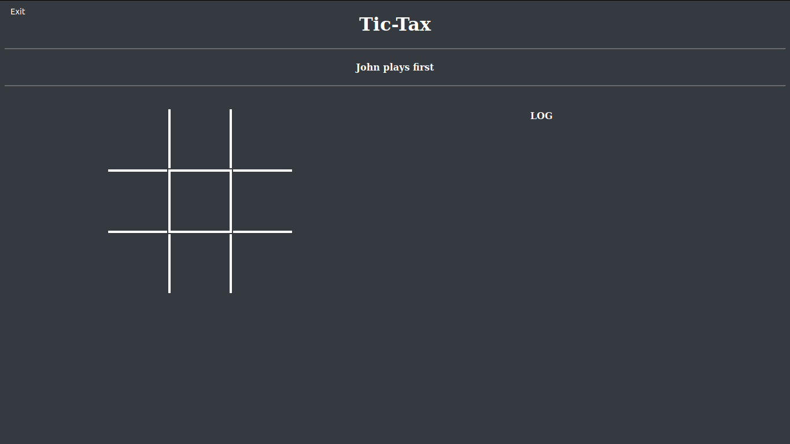
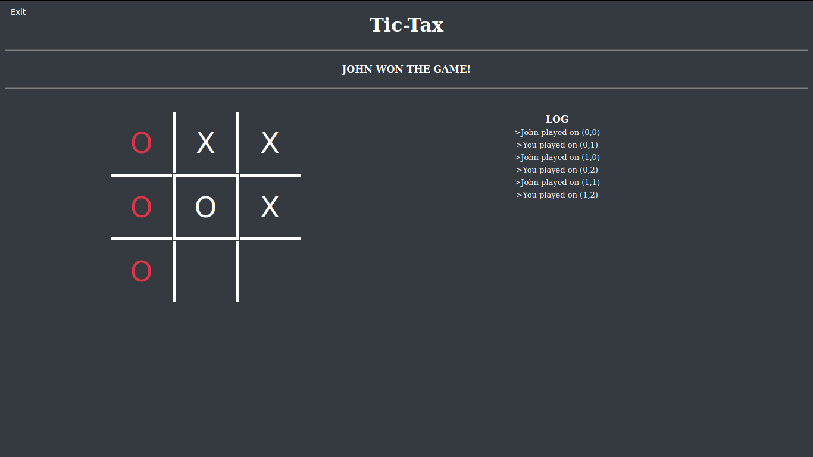
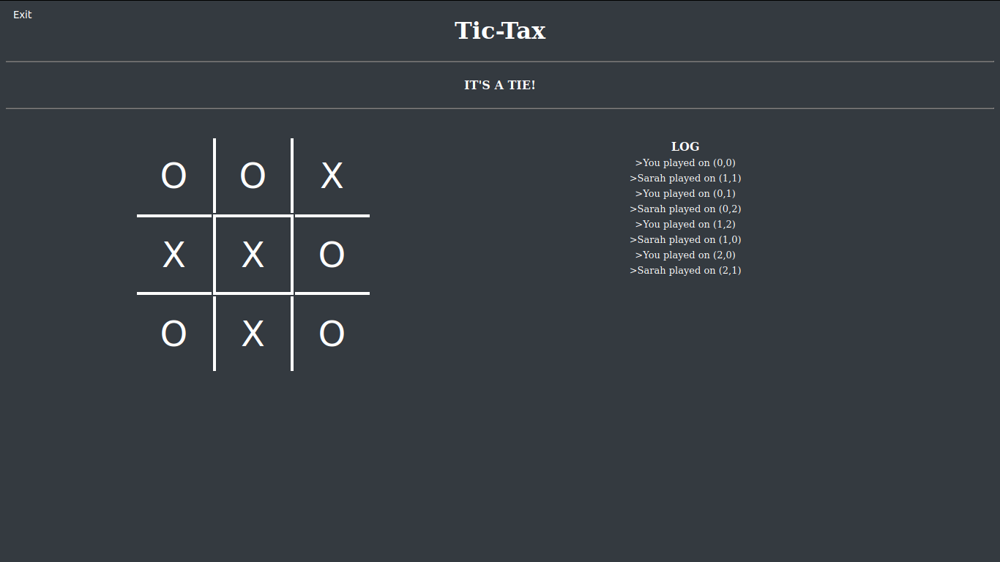

# Tic-Tax
Tic-Tax is a simple multiplayer Tic-Tac-Toe game.

## Made with:
Spring-Boot

## Written in:
-Java
-JavaScript
    
## Screenshots

 
 
 
 
 
    
## How to play:
1. Download or clone the project : 
~~~
git clone https://github.com/adxl/Tic-Tax.git
~~~
2. Run with Maven:
~~~
./mvnw spring-boot:run
~~~
3. Use [ngrok](https://ngrok.com/) to play online with a friend, or open http://localhost:8080 in two tabs/windows for a local match.

